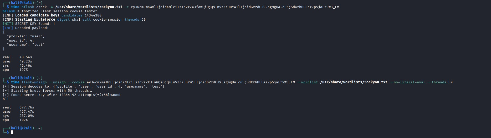

# bflask


> Fast Go CLI for bruteforcing Flask signed session cookies.
>
> Started as a Codex test and later published after working well in CTFs.

> [!WARNING]
> Use this tool only in authorized security testing, educational labs, and CTF environments.

## Benchmark

| Tool | Time |
|------|------|
| flask-unsign | 677.76s |
| bflask | **48.54s** |



## Install

```bash
go install github.com/MyCode83/bflask@latest
```

From source:

```bash
go build .
```
> [!IMPORTANT]
> Requires Go 1.25 or newer.

## Usage

```bash
bflask crack \
  -c "eyJ1c2VyIjoiYWRtaW4ifQ..." \
  -w rockyou.txt \
  -t 100
```

JSON output:

```bash
bflask crack -c "$COOKIE" -w keys.txt -j
```

With SHA-256 and a timeout:

```bash
bflask crack -c "$COOKIE" -w keys.txt -d sha256 --timeout 2m
```

Write the hit to a file:

```bash
bflask crack -c "$COOKIE" -w keys.txt -o result.json
```

Print only the recovered `SECRET_KEY`:

```bash
bflask -q crack -c "$COOKIE" -w keys.txt
```

Sign a cookie and print only the cookie value:

```bash
bflask -q sign -k supersecret -p '{"user":"admin"}' -s cookie-session -d sha256
```

Decode a cookie payload:

```bash
bflask decode -c "$COOKIE"
```

Decode only the raw payload:

```bash
bflask -q decode -c "$COOKIE" --raw
```


## Configuration

Priority is `CLI > ENV > CONFIG > DEFAULT`.

Example `config.yaml`:

```yaml
cookie: ""
wordlist: "./wordlist.txt"
threads: 50
salt: "cookie-session"
digest: "sha1"
verbose: false
timeout: "0s"
output: ""
json: false
quiet: false
```

Use a config file:

```bash
bflask --config config.yaml crack
```

Environment variables use the `BFLASK_` prefix:

```bash
BFLASK_THREADS=200 BFLASK_DIGEST=sha256 bflask crack -c "$COOKIE" -w keys.txt
```

Running `bflask --config config.yaml` without a subcommand starts `crack` with
the values from the config file. Running `bflask` without a config file or
subcommand prints help.

## How Flask Cookies Work

Flask's default session stores data client-side and signs it with `SECRET_KEY` through itsdangerous. The data is not encrypted. If the signing key is guessed, the payload can be verified and decoded. `bflask` checks candidate keys with URLSafeTimedSerializer-compatible HMAC signing, `cookie-session` salt by default, and SHA-1 by default.

Compressed Flask cookies start with a leading `.`. `bflask` supports decoding these zlib-compressed payloads when a valid key is found.

## Sample Flask App

A tiny app for generating a test cookie is in `examples/flask/app.py`:

```bash
cd examples/flask
python -m flask --app app run
```

Visit `http://127.0.0.1:5000/`, copy the `session` cookie, and test it with a wordlist containing `supersecret`, salt `11`, digest `sha256`.

## Troubleshooting

`invalid Flask cookie format`: pass only the cookie value, not `session=<value>` or a full `Cookie:` header.

`unsupported digest`: use one of `sha1`, `sha224`, `sha256`, `sha384`, `sha512`, or `md5`.

No hit found: check the salt, digest, wordlist encoding, and whether the target uses Flask's default signed session serializer.
